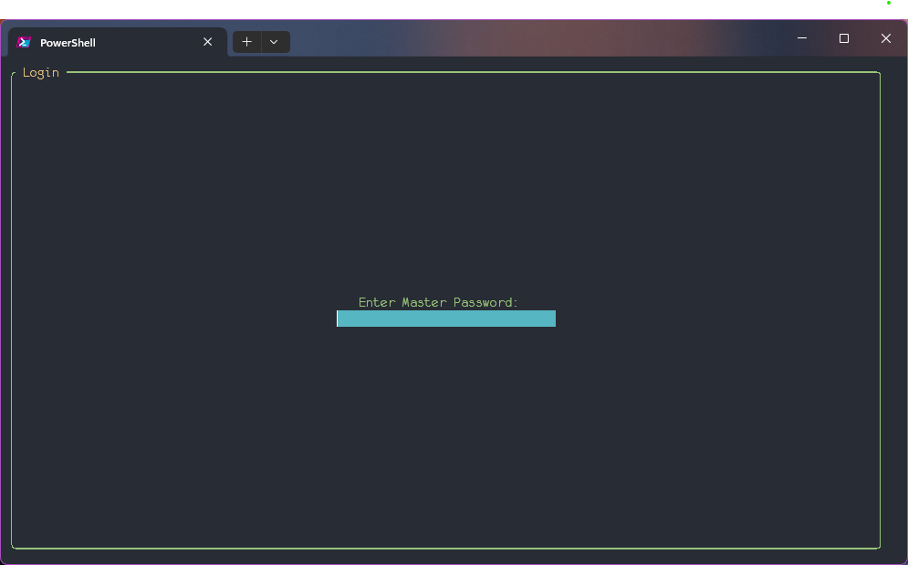
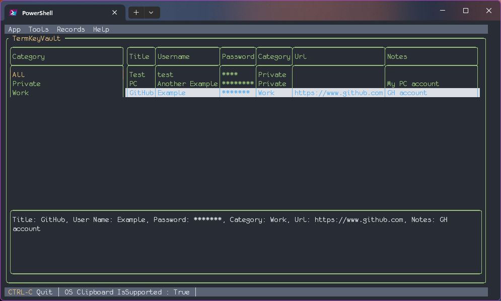
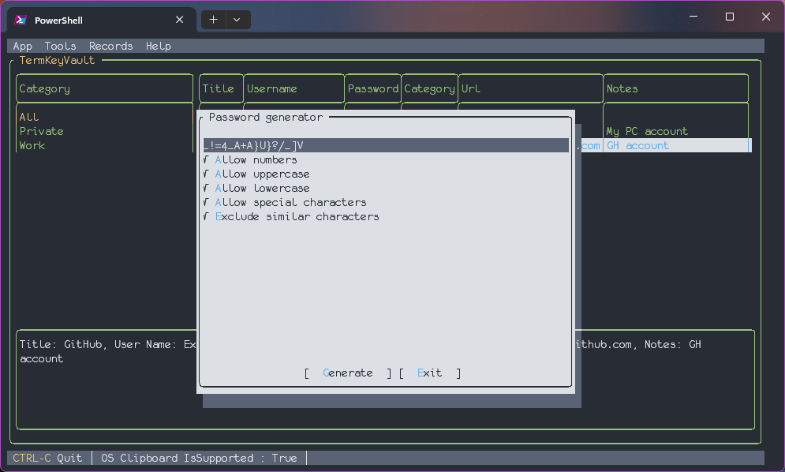

# TermKeyVault 🗝️

Terminal password manager

## Warning ⚠️
TermKeyValut is still in development and is not ready for use. Do not have high expectations for this project.

## Description 📝
TermKeyValut is my side project to explore [Functional Programming](https://en.wikipedia.org/wiki/Functional_programming), [F#](https://fsharp.org/) and how it works with [Terminal.Gui](https://github.com/gui-cs/Terminal.Gui). The idea is to create a password manager that is easy to use and can be used in the terminal.
It is by no means secure (although it uses encrypted SQLite database and uses basic encryption) and if your main goal is to have a secure password manager, I would recommend using [KeePass](https://keepass.info/), from which I drew inspiration while developing this application.

## Screenshots 📷




## Installation 📦

To install whale you need to have the following dependencies installed on your system:

- [.NET](https://dotnet.microsoft.com/download/dotnet/7.0)
- Modern Terminal - For Windows: [Windows Terminal](https://www.microsoft.com/en-us/p/windows-terminal/9n0dx20hk701?activetab=pivot:overviewtab)

Once you have the dependencies installed, you can download TermKeyVault using this command:
```bash
dotnet tool install --global TermKeyVault
```

TermKeyVault is constantly being developed, so to update it to the latest version, use the following command:

```bash
dotnet tool update --global TermKeyVault
```

## Usage 🧑‍💻 
To use TermKeyVault type `tkv` in terminal. You will be prompted to enter your master password. If you are using TermKeyVault for the first time, you will be asked to create a new database. After that you will be presented with the main menu.

## TechStack 📚
- [F#](https://fsharp.org/)
- [SQLite](https://www.sqlite.org/index.html)
- [Terminal.Gui](https://github.com/gui-cs/Terminal.Gui)

## Development 🛠️
To get started clone the repository:
```bash
git clone https://github.com/MaciekWin3/TermKeyVault
```
And you are ready to go! Just bare in mind that if you are using TermKeyVault as a password manager, your development setup will conflict with your production setup.
Also I recommend using [DB Browser for SQLite](https://sqlitebrowser.org/) to access encrytpted SQLite database.

## Notes 📒 

This project was written with the purpose of exploring the F# language and how it interacts with the Terminal.Gui library. My experience has shown that initially, this combination is well-suited for building a simple prototype. However, when it comes to developing more complex applications where two components are interdependent, I'd prefer to use C#. Since this was my first major project in F#, the code quality could have been better, so I encourage contributions.

# Contributing 🤝
If you want to contribute to this project, feel free to do so. I am open to any suggestions and improvements.
